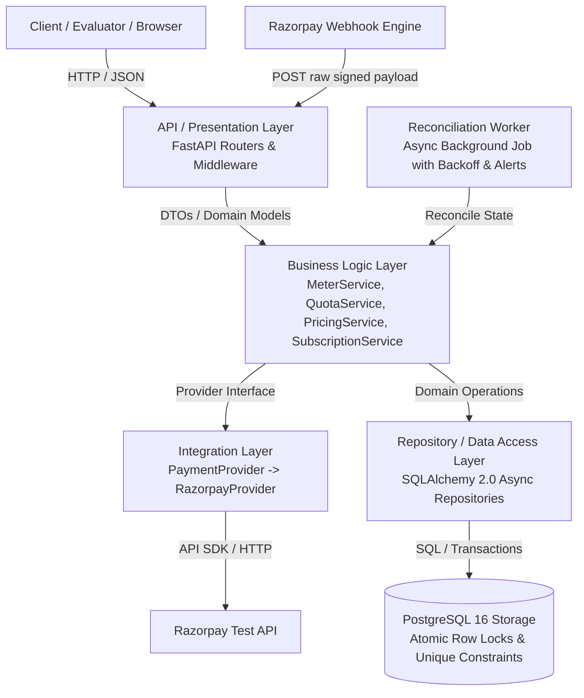
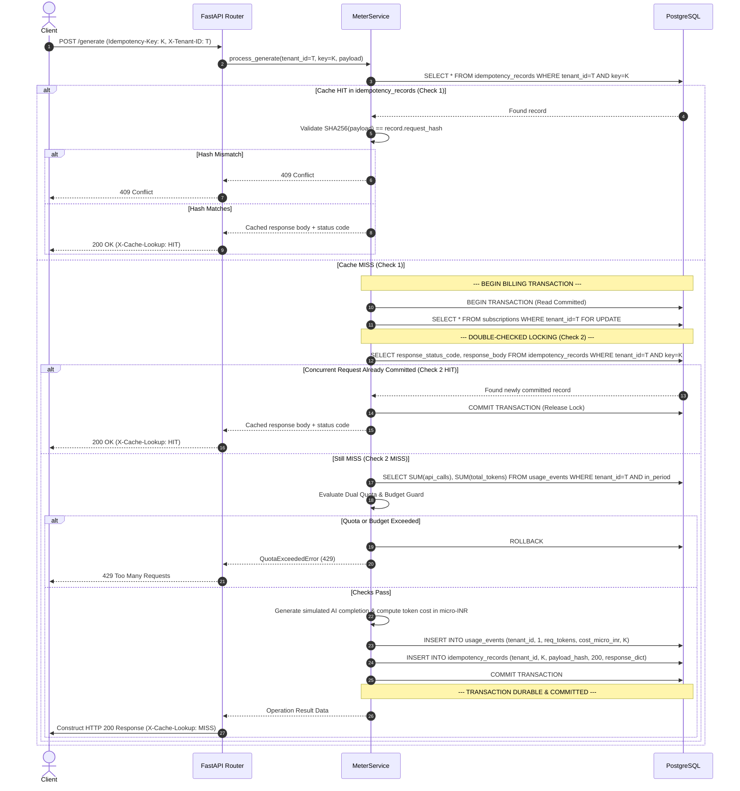

# DESIGN DOCUMENT: Usage Metering & Billing Engine
**FlyRank AI Backend Development Internship — Capstone Project**  
**Author / Development Agent:** Lead Backend Engineer (Antigravity)  
**Specification Version:** 2.0 (Production-Ready Architecture Specification)  
**Status:** PRODUCTION READY — FINAL SOURCE OF TRUTH  

---

## 1. Executive Summary & Objective

The primary objective of this project is to build an industrial-grade, multi-tenant **Usage Metering & Billing Engine** that accurately and deterministically answers three core questions:
1. **How much has a customer used?** (Multi-tenant dual-quota usage metering for API calls and AI token categories)
2. **How much should they pay?** (Exact integer-only money calculations using a single canonical internal currency unit)
3. **Have they reached their plan limits?** (Strict pre-request dual-quota enforcement and per-call budget guards with honest HTTP status codes)

The system is engineered for absolute correctness under real-world operational hazards:
- Network retries and concurrent duplicate requests
- Concurrent requests racing at quota and budget boundaries
- Forged, replayed, or out-of-order payment webhooks
- Database transaction failures and partial writes
- Zero floating-point rounding errors in token pricing

---

## 2. Requirement Extraction from FlyRank PDF

| Category | Requirement | Specification Details | Source / Rule |
|---|---|---|---|
| **Tenancy** | Multi-tenant isolation | Every tenant is an isolated organization. Tenant A can never view or mutate Tenant B's usage, subscriptions, or events. Server-side query filtering (`WHERE tenant_id = :tenant_id`) is strictly enforced. | PDF Page 10 |
| **Plans & Quotas** | Free & Pro tiers | **Free Plan (Pinned by PDF):** 1,000 API calls/month, 100,000 AI tokens/month, ₹0 monthly price.<br>**Pro Plan (Project-Defined Production Tier):** 50,000 API calls/month, 5,000,000 AI tokens/month, ₹1,999/month (1,999,000,000 $\mu\text{INR}$). | PDF Page 3 |
| **Metering** | Billable endpoint & usage recording | Single dummy billable endpoint (`POST /api/v1/generate`) simulating AI operations with 4 token categories. It meters API calls and AI tokens without requiring real LLM model calls. | PDF Page 5 |
| **Dual Quota** | API call + AI token quota | Every successful `POST /generate` consumes **1 API call AND requested AI tokens**. Both quota dimensions are verified before accepting the operation. | Capstone Brief §4 |
| **Budget Guard** | Per-call & monthly cost limit | Cost is tracked per call, attributed to the tenant, with a budget guard enforcing maximum allowable cost per call. | PDF Page 8 Requirement #7 |
| **Idempotency** | Exactly-once metering | Requests supply `Idempotency-Key` header (max 128 chars). Duplicate requests return original cached response without double-counting usage. Enforced via database uniqueness constraints and double-checked locking. | PDF Page 3 & 4 |
| **Quota Enforcement** | Pre-execution boundary check | `current_usage + requested_usage <= plan_limit` evaluated for both dimensions before operation execution. Boundary honesty: at limit, request allowed; over limit, rejected. | PDF Page 3 |
| **Status Codes** | Honest HTTP semantics | `429 Too Many Requests` when monthly usage quota (API calls, tokens, or budget) is exceeded.<br>`402 Payment Required` when plan upgrade or active subscription payment is required. | PDF Page 3 |
| **Pricing Rules** | Exact AI token pricing | 4 token categories: (1) Fresh input tokens, (2) Cached input tokens (cheaper/discounted), (3) Output tokens (standard rate), (4) Reasoning/thinking tokens (billed at output rate). | PDF Page 4 |
| **Money Arithmetic** | Zero floating-point math | All currency stored and computed as integer **micro-INR** ($\mu\text{INR}$). Pinned pricing constants in configuration. | PDF Page 3 |
| **Payment Provider** | Provider adaptation (Stripe -> Razorpay) | Use Razorpay Test/Sandbox mode for Indian development environment while preserving all underlying subscription lifecycle semantics. | Provider Adaptation §2 |
| **Webhooks** | Cryptographic verification & replay protection | Verify `X-Razorpay-Signature` HMAC-SHA256 using constant-time comparison before DB mutation. Deduplicate via persistent `payment_events` table using the `x-razorpay-event-id` header. | Provider Adaptation §17 |
| **Background Processing** | Subscription reconciliation | Periodic lightweight background worker with exponential backoff and failure alerting, reconciling database subscription state with Razorpay API. | PDF Page 8 Requirement #3 |
| **Persistence** | PostgreSQL & Alembic | Strict relational schemas, foreign keys, compound indexes, and version-controlled Alembic migrations. | PDF Page 8 Requirement #4 |
| **Quality & Evidence** | Pytest & Acceptance Probes | Complete automated test suite covering all 5 FlyRank acceptance probes, documented with transcripts in `EVIDENCE.md`. | PDF Page 8 & 10 |

---

## 3. Evaluation Criteria & Acceptance Probes

### 3.1 Evaluation Layer 1: Submission Pack (Machine-Checkable)
- Repository root contains: `README.md`, `DESIGN.md`, `capstone.yaml`, `EVIDENCE.md`, `BUILDLOG.md`, `.env.example`, `Dockerfile`, `docker-compose.yml`.
- `capstone.yaml` contains executable, working commands for `run`, `seed`, `test`, `base_url`, and probe endpoint mappings.
- Clean machine boots with one documented command: `docker compose up --build`.

### 3.2 Evaluation Layer 2: Acceptance Probes Specification

The 5 behavioral acceptance probes are specified with strict engineering contracts:

#### PROBE 1: Idempotent Metering Verification (Sequential & Concurrent)
- **Setup:** Seed clean tenant $T_1$ on Free plan (0 API calls used, 0 tokens used).
- **Request:** Send `POST /api/v1/generate` twice (first sequentially, then concurrently across parallel threads) with identical header `Idempotency-Key: probe-1-key-001`, header `X-Tenant-ID: T1`, and body containing 500 fresh input, 200 cached input, 100 output, and 50 reasoning tokens.
- **Expected Database State:**
  - `idempotency_records`: Exactly 1 row for tenant $T_1$ and key `probe-1-key-001`.
  - `usage_events`: Exactly 1 row recording 1 API call and 850 total tokens.
  - Quota counters incremented exactly once.
- **Expected HTTP Response:**
  - Call 1: `200 OK` with generated response body and metering payload.
  - Call 2: `200 OK` with identical response body and metering payload matching Call 1.
- **Expected Headers:**
  - Call 1: `X-Cache-Lookup: MISS`.
  - Call 2: `X-Cache-Lookup: HIT`.
- **Cleanup:** Delete test usage events and idempotency records for tenant $T_1$.

#### PROBE 2: Quota Boundary Honesty (Dual-Dimension Boundary)
- **Setup:** Seed tenant $T_2$ on Free plan (limits: 1,000 API calls, 100,000 tokens). Pre-populate usage to exactly 999 API calls and 99,000 tokens.
- **Request:**
  - Boundary Call #1000: `POST /api/v1/generate` requesting 1 API call and 500 tokens.
  - Beyond Boundary Call #1001: `POST /api/v1/generate` requesting 1 API call and 500 tokens.
- **Expected Database State:**
  - After Call #1000: Total usage in DB = 1,000 API calls, 99,500 tokens.
  - After Call #1001: Total usage in DB remains exactly 1,000 API calls, 99,500 tokens (Call #1001 recorded zero usage events).
- **Expected HTTP Response:**
  - Call #1000: `200 OK`, successful generation result.
  - Call #1001: `429 Too Many Requests`, JSON body:
    ```json
    {
      "error": "quota_exceeded",
      "message": "Monthly API call quota exceeded (1000/1000). Upgrade to Pro or wait until next billing cycle.",
      "quota_dimension": "api_calls",
      "limit": 1000,
      "used": 1000,
      "requested": 1,
      "retry_after_seconds": 86400
    }
    ```
- **Expected Headers:**
  - Call #1000: Standard response headers.
  - Call #1001: `Retry-After: <seconds_until_next_billing_cycle>`.
- **Cleanup:** Reset tenant $T_2$ usage events.

#### PROBE 3: Razorpay Test Subscription Upgrade Flow
- **Setup:** Seed tenant $T_3$ on Free plan (limits: 1,000 calls / 100k tokens). Subscription record exists with `status = 'pending'` and `provider_subscription_id = 'sub_probe3_test'`.
- **Request:**
  1. Trigger webhook: `POST /api/v1/webhooks/razorpay` with valid HMAC signature and payload `subscription.activated` for subscription `sub_probe3_test`.
  2. Query usage: `GET /api/v1/usage` with `X-Tenant-ID: T3`.
- **Expected Database State:**
  - `subscriptions.status` updated from `pending` to `active`.
  - `subscriptions.plan_id` updated to Pro plan.
  - `payment_events` contains 1 row with status `processed`.
- **Expected HTTP Response:**
  - Webhook request: `200 OK` (`{"status": "processed"}`).
  - `GET /api/v1/usage`: `200 OK` reflecting Pro limits:
    ```json
    {
      "plan": "pro",
      "api_calls": { "limit": 50000 },
      "ai_tokens": { "limit": 5000000 }
    }
    ```
- **Expected Headers:** Standard JSON response headers.
- **Cleanup:** Reset tenant $T_3$ subscription to Free plan.

#### PROBE 4: Webhook Signature Verification & Deduplication
- **Setup:** Seed tenant $T_4$ with test subscription `sub_probe4_test`.
- **Request:**
  - Step 4a (Forged Webhook): Send `POST /api/v1/webhooks/razorpay` with invalid signature `X-Razorpay-Signature: forged_signature_hex` and `x-razorpay-event-id: evt_probe4_forged`.
  - Step 4b (Valid Webhook): Send `POST /api/v1/webhooks/razorpay` with valid HMAC signature and `x-razorpay-event-id: evt_probe4_valid` activating subscription.
  - Step 4c (Replayed Webhook): Resend exact same request as 4b with `x-razorpay-event-id: evt_probe4_valid`.
- **Expected Database State:**
  - After 4a: Zero database mutations. Zero rows added to `payment_events`. Subscription status unchanged.
  - After 4b: Exactly 1 row inserted into `payment_events` (`provider_event_id='evt_probe4_valid'`, `status='processed'`). Subscription activated.
  - After 4c: Still exactly 1 row in `payment_events`. Zero duplicate state mutations.
- **Expected HTTP Response:**
  - 4a: `400 Bad Request` with `{"error": "invalid_signature"}`.
  - 4b: `200 OK` with `{"status": "processed"}`.
  - 4c: `200 OK` with `{"status": "ignored", "reason": "duplicate_webhook"}`.
- **Expected Headers:** Standard JSON response headers.
- **Cleanup:** Remove `evt_probe4_valid` from `payment_events`.

#### PROBE 5: AI Token Pricing Verification
- **Setup:** Seed clean tenant $T_5$. Project-defined pricing constants active:
  - Fresh Input: 40 $\mu\text{INR}$/token
  - Cached Input: 10 $\mu\text{INR}$/token (75% discount)
  - Output: 160 $\mu\text{INR}$/token
  - Reasoning: 160 $\mu\text{INR}$/token
- **Request:**
  1. `POST /api/v1/generate` with:
     - 1,000 Fresh Input tokens
     - 2,000 Cached Input tokens
     - 500 Output tokens
     - 200 Reasoning tokens
  2. `GET /api/v1/usage` with `X-Tenant-ID: T5`.
- **Expected Database State:**
  - `usage_events` records 1 row with:
    $$\text{cost\_micro\_inr} = (1000 \times 40) + (2000 \times 10) + (500 \times 160) + (200 \times 160)$$
    $$= 40,000 + 20,000 + 80,000 + 32,000 = 172,000\ \mu\text{INR}$$
- **Expected HTTP Response:**
  - `POST /generate`: `200 OK`, `metering.cost_micro_inr = 172000` (formatted `₹0.172`).
  - `GET /usage`: `200 OK`, `total_cost_micro_inr = 172000`, breakdown matching exact quantities.
- **Expected Headers:** Standard JSON response headers.
- **Cleanup:** Reset tenant $T_5$ usage events.

---

## 4. System Architecture Proposal

The system adopts a strict 4-tier layered architecture enforcing unidirectional dependency flow:



### 4.1 Layer Responsibilities
1. **API / Presentation Layer (`app/api/v1/`)**:
   - Handles HTTP routing, request parsing, and response serialization via Pydantic v2 schemas.
   - Extracts and validates headers: `X-Tenant-ID`, `Idempotency-Key` (max length 128), `X-Razorpay-Signature`, `x-razorpay-event-id`.
   - Captures raw request bytes *before* parsing JSON for cryptographic signature verification.
   - Provides clean 4xx responses; never leaks internal stack traces or 500 errors on bad input.
2. **Business Logic Layer (`app/services/`)**:
   - `MeterService`: Coordinates double-checked idempotency, dual-quota pre-validation, per-call budget guards, billable action execution, and usage event recording within atomic database transactions.
   - `QuotaService`: Evaluates monthly quota bounds for both API calls and tokens, dynamically computes UTC calendar-month billing periods for Free tenants, and determines `429` vs `402` HTTP boundary conditions.
   - `PricingService`: Pure integer cost engine computing AI token category pricing (cached input discount, reasoning tokens mapped to output rate) with zero floating-point math.
   - `SubscriptionService`: Manages subscription transitions, plan mappings, and webhook event processing with monotonic state guards.
3. **Integrations Layer (`app/integrations/payments/`)**:
   - Defines abstract `PaymentProvider` interface (`create_customer`, `create_subscription`, `verify_webhook_signature`, `parse_webhook_event`, `fetch_subscription`).
   - Implements `RazorpayProvider` encapsulating Razorpay SDK interactions and test mode handling.
4. **Data Access Layer (`app/repositories/`)**:
   - Encapsulates SQLAlchemy async ORM queries.
   - Employs `SELECT ... FOR UPDATE` row-level locks on the tenant's `subscriptions` record during quota checks to prevent concurrent race conditions.
5. **Worker Layer (`app/workers/`)**:
   - Resilient, standalone async background worker periodically querying non-terminal drifting subscriptions using `SELECT ... FOR UPDATE SKIP LOCKED` and reconciling state against Razorpay's API with exponential backoff and structured alerts.

---

## 5. Database Schema Design (PostgreSQL 16)

```mermaid
erDiagram
    tenants ||--o| subscriptions : has
    tenants ||--o{ usage_events : generates
    tenants ||--o{ idempotency_records : stores
    plans ||--o{ subscriptions : defines
    payment_events ||--o| subscriptions : verifies

    tenants {
        uuid id PK
        varchar name
        timestamptz created_at
        timestamptz updated_at
    }

    plans {
        uuid id PK
        varchar name UK "free, pro"
        bigint api_call_quota
        bigint token_quota
        bigint max_cost_per_call_micro_inr "budget guard ceiling"
        bigint price_micro_inr "integer micro-INR: 0 or 1999000000"
        varchar currency "INR"
        varchar billing_interval "month"
        boolean is_active
        timestamptz created_at
    }

    subscriptions {
        uuid id PK
        uuid tenant_id FK, UK "Guaranteed 1 row per tenant"
        uuid plan_id FK
        varchar provider "razorpay"
        varchar provider_customer_id
        varchar provider_subscription_id UK, Index
        varchar provider_plan_id
        varchar status "created, authenticated, active, pending, halted, paused, cancelled, completed, expired"
        timestamptz current_period_start
        timestamptz current_period_end
        timestamptz created_at
        timestamptz updated_at
    }

    usage_events {
        uuid id PK
        uuid tenant_id FK, Index
        varchar usage_type "generate"
        bigint api_calls "1"
        bigint total_tokens "sum of token categories"
        integer fresh_input_tokens
        integer cached_input_tokens
        integer output_tokens
        integer reasoning_tokens
        bigint cost_micro_inr "canonical integer micro-INR"
        varchar idempotency_key Index
        timestamptz timestamp Index
    }

    idempotency_records {
        uuid id PK
        uuid tenant_id FK
        varchar idempotency_key "max 128 chars"
        varchar request_hash "SHA-256 of payload"
        integer response_status_code
        jsonb response_body "Cached API response payload"
        timestamptz created_at
    }

    payment_events {
        uuid id PK
        varchar provider "razorpay"
        varchar provider_event_id UK "x-razorpay-event-id from request header"
        varchar event_type "subscription.activated, etc."
        varchar payload_hash "SHA-256 of raw webhook"
        jsonb raw_payload
        varchar status "processed, ignored, failed"
        text error_message
        timestamptz processed_at
        timestamptz created_at
    }
```

### 5.1 Critical Constraints & Indexes DDL Specification
1. **Primary Idempotency Mechanism:**
   `idempotency_records` table with `UNIQUE (tenant_id, idempotency_key)` acts as the primary request identity registry and response cache.
2. **Defense-in-Depth Ledger Invariant:**
   `usage_events` has `UNIQUE (tenant_id, idempotency_key) WHERE idempotency_key IS NOT NULL`. This constraint is an additional physical safety barrier preventing duplicate usage records even if application caching logic regresses.
3. **Webhook Deduplication Invariant:**
   `payment_events` with `UNIQUE (provider, provider_event_id)` guarantees replay protection at the storage level.
4. **Subscription Row Guarantee:**
   Every tenant is provisioned with an initial Free subscription row upon onboarding. The row `subscriptions WHERE tenant_id = :tenant_id` is **guaranteed to exist** for every billable tenant and serves as the row lock target for `SELECT FOR UPDATE`.
5. **Covering Index for High-Performance Usage Rollups:**
   ```sql
   CREATE INDEX idx_usage_events_rollup 
   ON usage_events (tenant_id, timestamp) 
   INCLUDE (api_calls, total_tokens, cost_micro_inr);
   ```

---

## 6. Canonical Money Units & Currency Strategy

### 6.1 The Single Canonical Internal Currency Unit
To avoid floating-point errors and prevent mixing units, all internal monetary amounts, calculations, database columns, and service interfaces strictly use:
$$\mathbf{micro\_inr}\quad (\mu\text{INR})$$
Where:
$$1 \text{ INR} = 100 \text{ Paise} = 1,000,000\text{ micro\_inr}$$
$$1 \text{ Paise} = 10,000\text{ micro\_inr}$$

### 6.2 Boundary Conversion Rules
- **Database Storage:** All prices, costs, and budgets are stored as `BIGINT micro_inr`.
  - Free Plan Price: `0` $\mu\text{INR}$
  - Pro Plan Price: ₹1,999 = `1999000000` $\mu\text{INR}$
  - Free Budget Guard Ceiling: ₹10.00 / call = `10000000` $\mu\text{INR}$
  - Pro Budget Guard Ceiling: ₹100.00 / call = `100000000` $\mu\text{INR}$
- **External Provider Interface (Razorpay):** Razorpay requires integer paise. Conversion occurs solely at the provider boundary:
  $$\text{amount\_paise} = \text{price\_micro\_inr} \mathbin{//} 10,000$$
- **User-Facing Presentation:** External JSON formatting converts micro-INR to standard currency display strings:
  $$\text{formatted} = \text{f"₹\{cost\_micro\_inr / 1\_000\_000:.2f\}"}$$

---

## 7. Deterministic AI Token Pricing & Cost Engine

### 7.1 Separation of PDF Requirements vs Project Pricing Constants
- **FlyRank PDF Requirements:**
  - Cached input tokens are cheaper.
  - Reasoning tokens count as output tokens.
  - Token categories cannot simply be added together before pricing.
  - Pricing constants must be pinned in configuration with proof of correct totals in `EVIDENCE.md`.
- **Project-Defined Pricing Constants (Pinned in `app/core/config.py`):**
  We define clean integer rates in $\mu\text{INR}$ per token that eliminate division and truncation errors:
  - **Fresh Input Token Rate ($R_{\text{fresh}}$):** ₹40.00 / 1,000,000 tokens $\to \mathbf{40\ \mu\text{INR}}$ per token.
  - **Cached Input Token Rate ($R_{\text{cached}}$):** ₹10.00 / 1,000,000 tokens $\to \mathbf{10\ \mu\text{INR}}$ per token (exact 75% discount relative to fresh input).
  - **Output Token Rate ($R_{\text{output}}$):** ₹160.00 / 1,000,000 tokens $\to \mathbf{160\ \mu\text{INR}}$ per token.
  - **Reasoning Token Rate ($R_{\text{reasoning}}$):** $\mathbf{160\ \mu\text{INR}}$ per token (strictly pinned to output rate per PDF rules).

### 7.2 Deterministic Pure-Multiplication Integer Formula
$$\text{Cost}_{\mu\text{INR}} = (N_{\text{fresh}} \times 40) + (N_{\text{cached}} \times 10) + (N_{\text{output}} + N_{\text{reasoning}}) \times 160$$
*Proof:* Every operation is integer multiplication and addition. Zero division. Zero truncation. Zero IEEE-754 floating-point drift for every possible token count.

---

## 8. Dual-Quota Enforcement & Budget Guard Strategy

Every billable call to `POST /api/v1/generate` consumes **BOTH**:
1. **1 API call** ($\Delta\text{api\_calls} = 1$)
2. **$N_{\text{requested}}$ AI tokens** ($N_{\text{fresh}} + N_{\text{cached}} + N_{\text{output}} + N_{\text{reasoning}}$)

### 8.1 Tri-Partite Pre-Execution Validation Rule
Before executing any billable operation, the engine checks:
1. **API Call Quota:** $\text{used\_api\_calls} + 1 \le \text{plan\_api\_quota}$
2. **AI Token Quota:** $\text{used\_tokens} + N_{\text{requested}} \le \text{plan\_token\_quota}$
3. **Per-Call Budget Guard (Requirement #7):** $\text{projected\_cost}_{\mu\text{INR}} \le \text{plan.max\_cost\_per\_call\_micro\_inr}$

### 8.2 Quota & Budget Decision Table

| Plan API Limit | Plan Token Limit | Used API Calls | Used Tokens | Requested Tokens | Projected Call Cost | Max Cost / Call | Decision | HTTP Status & Reason |
|:---:|:---:|:---:|:---:|:---:|:---:|:---:|:---:|:---:|
| 1,000 | 100,000 | 999 | 50,000 | 500 | 80,000 $\mu$INR | 10M $\mu$INR | **ALLOWED** | `200 OK` |
| 1,000 | 100,000 | 1,000 | 50,000 | 500 | 80,000 $\mu$INR | 10M $\mu$INR | **REJECTED** | `429 Too Many Requests` (api_calls) |
| 1,000 | 100,000 | 500 | 99,500 | 600 | 96,000 $\mu$INR | 10M $\mu$INR | **REJECTED** | `429 Too Many Requests` (ai_tokens) |
| 1,000 | 100,000 | 500 | 50,000 | 70,000 | 11.2M $\mu$INR | 10M $\mu$INR | **REJECTED** | `429 Too Many Requests` (budget_guard) |

### 8.3 Free Tier Billing Period Resolution & Rollover Logic
To ensure Free tier quotas reset cleanly every month without depending on payment provider webhooks:
- In `QuotaService`, the active billing window for a Free tenant is determined dynamically:
  $$\text{period\_start} = \text{datetime(UTC.year, UTC.month, 1, 0, 0, 0)}$$
  $$\text{period\_end} = \text{datetime(UTC.year, UTC.month, last\_day, 23, 59, 59)}$$
- If `subscriptions.current_period_end < NOW()` on a Free plan, the transaction lazily updates `current_period_start` and `current_period_end` to the current calendar month under the row lock.

---

## 9. Concurrency, Locking & Transaction Semantics

### 9.1 Exact Lock Target & Guaranteed Existence
To eliminate race conditions without whole-table locking:
- Every tenant has exactly one row in `subscriptions` created upon registration.
- The transaction acquires a pessimistic row-level lock:
  ```sql
  SELECT id, plan_id, status, current_period_start, current_period_end
  FROM subscriptions
  WHERE tenant_id = :tenant_id
  FOR UPDATE;
  ```
- This serializes billable operations for that specific tenant while allowing all other tenants to operate concurrently.

### 9.2 Double-Checked Locking Sequence & Decoupled Serialization



---

## 10. Webhook Security & Ingestion Strategy

### 10.1 Webhook Signature Verification (Raw Body Capture)
1. FastAPI route receives `request: Request`.
2. Raw bytes are extracted *before* any JSON deserialization:
   ```python
   raw_body = await request.body()
   signature = request.headers.get("X-Razorpay-Signature")
   ```
3. Compute expected HMAC-SHA256 using `RAZORPAY_WEBHOOK_SECRET`:
   ```python
   expected_signature = hmac.new(
       key=settings.RAZORPAY_WEBHOOK_SECRET.encode("utf-8"),
       msg=raw_body,
       digestmod=hashlib.sha256
   ).hexdigest()
   ```
4. Verify using constant-time comparison: `hmac.compare_digest(expected_signature, signature)`.
5. **Rejection Policy:** If signature verification fails or header is missing, immediately return `400 Bad Request` with `{"error": "invalid_signature"}`. Zero database operations occur.

### 10.2 Official Event Identifier Extraction & Deduplication
1. Razorpay supplies the unique delivery event ID in the HTTP request header:
   $$\mathbf{x\text{-}razorpay\text{-}event\text{-}id}$$
2. The engine extracts:
   ```python
   provider_event_id = request.headers.get("x-razorpay-event-id")
   ```
   *(If header is absent in synthetic test fixtures, deterministic fallback: `f"syn_{sha256(event_name + entity_id + str(created_at))}"`).*
3. Webhook idempotency is enforced via `payment_events` with `UNIQUE(provider, provider_event_id)`:
   - On new event: Insert record into `payment_events` with status `processed`.
   - On duplicate replay: Unique constraint collision triggers `ON CONFLICT DO NOTHING`, logs warning, and immediately returns `200 OK` (`{"status": "ignored", "reason": "duplicate_webhook"}`). Zero state re-mutation.

### 10.3 Monotonic State Guards (Preventing Out-of-Order Resurrection)
To prevent a delayed, out-of-order `subscription.activated` from overwriting a terminal `cancelled` status:
```sql
UPDATE subscriptions 
SET status = :new_status, plan_id = :new_plan_id, updated_at = NOW()
WHERE provider_subscription_id = :sub_id 
  AND status NOT IN ('cancelled', 'completed');
```

---

## 11. Razorpay Subscription State Machine & Lifecycle

The system maps official Razorpay subscription events to internal states and plan limits:

| Razorpay State | Definition in System | Quota & Tier Access | Triggering Webhook Events | Next Allowed States |
|---|---|---|---|---|
| **`created`** | Subscription created; customer has not authorized first payment | **Free Tier** (1,000 calls / 100k tokens) | Subscription initiated via API | `authenticated`, `active`, `cancelled`, `expired` |
| **`authenticated`** | Customer completed authentication transaction | **Free Tier** (Awaiting activation) | `subscription.authenticated` | `active`, `cancelled` |
| **`active`** | Payment verified; current cycle active and funded | **Pro Tier** (50,000 calls / 5M tokens) | `subscription.activated`, `subscription.charged` | `pending`, `paused`, `cancelled`, `completed` |
| **`pending`** | Auto-charge attempt failed; Razorpay retrying | **Pro Tier** (Grace period maintained during retries) | Auto-debit failure webhook | `active` (on retry success), `halted`, `cancelled` |
| **`paused`** | Subscription temporarily suspended | **Free Tier** (Pro access suspended) | `subscription.paused` | `active` (on `subscription.resumed`), `cancelled` |
| **`halted`** | Payment retries exhausted; invoices unpaid | **Free Tier** (Downgraded to Free) | `subscription.halted` | `active` (on manual invoice payment), `cancelled` |
| **`cancelled`** | Subscription terminated by customer or merchant | **Free Tier** (Downgraded to Free) | `subscription.cancelled` | *Terminal State* |
| **`completed`** | Fixed billing duration completed | **Free Tier** (Downgraded to Free) | `subscription.completed` | *Terminal State* |
| **`expired`** | Defined creation expiry window passed | **Free Tier** (Downgraded to Free) | Razorpay auto-expiry | *Terminal State* |

### Access Rule:
- **Pro Limits** are granted exclusively when `subscriptions.status IN ('active', 'pending')` AND `subscriptions.plan_id` resolves to the Pro plan.
- All other states automatically enforce **Free Limits**.

---

## 12. Resilient Background Reconciliation Worker

To satisfy FlyRank Shared Requirement #3 without bloated infrastructure (no Celery, Redis, or Kafka):
- Implemented as a standalone async worker utility in `app/workers/reconciliation.py`.
- **Concurrency Guard:** Uses `SELECT ... FOR UPDATE SKIP LOCKED` to allow multiple instances to run without collision:
  ```sql
  SELECT * FROM subscriptions 
  WHERE status IN ('pending', 'created') 
    AND updated_at < NOW() - INTERVAL '5 minutes'
  FOR UPDATE SKIP LOCKED;
  ```
- **Action & Retry Loop:** Calls Razorpay API (`client.subscription.fetch(sub_id)`) with exponential backoff (max 3 retries: 1s, 2s, 4s).
- **Failure Alerting:** On terminal network/provider failure, emits a structured alert:
  ```python
  logger.error(
      "ALERT: Subscription reconciliation failed for tenant %s (sub_id: %s)",
      sub.tenant_id, sub.provider_subscription_id,
      extra={"alert": True, "tenant_id": str(sub.tenant_id), "error": str(exc)}
  )
  ```
- If provider reports `active`, local database is updated to `active` and plan to Pro, with an audit log line recorded.

---

## 13. Strict Tenant Isolation Strategy

1. **Authentication / Identification Barrier:** Every tenant-facing endpoint requires `X-Tenant-ID` header containing a valid UUID.
2. **FastAPI Dependency Injection (`get_current_tenant`):** Validates UUID format, queries database to verify tenant exists, and injects `Tenant` domain model. Returns `404 Not Found` if tenant does not exist.
3. **Elimination of IDOR:**
   - Tenant profile endpoint is defined as **`GET /api/v1/tenants/me`** using the validated header context.
   - If a request supplies a path parameter `{tenant_id}`, the endpoint verifies:
     ```python
     if str(tenant_id) != str(current_tenant.id):
         raise HTTPException(status_code=403, detail="Forbidden: Cross-tenant access denied.")
     ```
4. **Mandatory Tenant Scoping in Data Layer:**
   Every query in `UsageRepository`, `SubscriptionRepository`, and `IdempotencyRepository` includes `WHERE tenant_id = :current_tenant_id`.

---

## 14. API Contract & OpenAPI Specification

All endpoints reside under `/api/v1` except `/health` and webhook listener:

### 14.1 System Health
- **`GET /health`**
  - Response `200 OK`: `{"status": "healthy", "database": "connected", "version": "1.0.0"}`

### 14.2 Tenant Management
- **`POST /api/v1/tenants`**
  - Request: `{"name": "Acme Corp"}`
  - Response `201 Created`: `{"id": "uuid", "name": "Acme Corp", "plan": "free", "created_at": "..."}`
- **`GET /api/v1/tenants/me`** (Header: `X-Tenant-ID: <uuid>`)
  - Response `200 OK`: Tenant profile and active subscription summary.

### 14.3 Billable AI Endpoint (Core Metering Probe)
- **`POST /api/v1/generate`**
  - Headers:
    - `X-Tenant-ID: <uuid>` (Required)
    - `Idempotency-Key: <string>` (Required, max length 128)
  - Request Body:
    ```json
    {
      "prompt": "Summarize quarterly financials",
      "model": "gpt-simulated",
      "simulated_tokens": {
        "fresh_input_tokens": 1000,
        "cached_input_tokens": 2000,
        "output_tokens": 500,
        "reasoning_tokens": 200
      }
    }
    ```
  - Response `200 OK`:
    ```json
    {
      "id": "gen_88f91a2b",
      "result": "Simulated AI completion result...",
      "metering": {
        "usage_event_id": "9b1deb4d-3b7d-4bad-9bdd-2b0d7b3dcb6d",
        "api_calls_metered": 1,
        "total_tokens_metered": 3700,
        "cost_micro_inr": 172000,
        "currency": "INR",
        "formatted_cost": "₹0.17"
      }
    }
    ```
  - Error Responses:
    - `400 Bad Request`: Validation failure (malformed UUID, negative tokens).
    - `409 Conflict`: `Idempotency-Key` reused with different request payload.
    - `429 Too Many Requests`: Monthly quota or budget guard exceeded.
      ```json
      {
        "error": "quota_exceeded",
        "message": "Monthly API call quota exceeded (1000/1000). Upgrade to Pro or wait until next billing cycle.",
        "quota_dimension": "api_calls",
        "limit": 1000,
        "used": 1000,
        "requested": 1,
        "retry_after_seconds": 86400
      }
      ```
    - `402 Payment Required`: Plan inactive or unpaid.

### 14.4 Usage & Analytics Rollup
- **`GET /api/v1/usage`** (Header: `X-Tenant-ID: <uuid>`)
  - Response `200 OK`:
    ```json
    {
      "tenant_id": "01946e5a-73d8-7408-8e65-728b7e732c1e",
      "plan": "free",
      "billing_period": {
        "start": "2026-10-01T00:00:00Z",
        "end": "2026-10-31T23:59:59Z"
      },
      "api_calls": {
        "used": 142,
        "limit": 1000,
        "remaining": 858
      },
      "ai_tokens": {
        "used": 42500,
        "limit": 100000,
        "remaining": 57500,
        "breakdown": {
          "fresh_input_tokens": 20000,
          "cached_input_tokens": 12500,
          "output_tokens": 7000,
          "reasoning_tokens": 3000
        }
      },
      "total_cost": {
        "micro_inr": 15450000,
        "formatted": "₹15.45"
      }
    }
    ```
- **`GET /api/v1/usage/events`** (Header: `X-Tenant-ID: <uuid>`)
  - Query params: `page=1&page_size=50`
  - Response `200 OK`: Paginated list of immutable usage events.

### 14.5 Subscription & Billing
- **`POST /api/v1/billing/subscription`** (Header: `X-Tenant-ID: <uuid>`)
  - Request: `{"plan_name": "pro"}`
  - Response `201 Created`:
    ```json
    {
      "subscription_id": "sub_xyz789test",
      "provider": "razorpay",
      "razorpay_key_id": "rzp_test_placeholder",
      "plan": "pro",
      "amount_paise": 199900,
      "currency": "INR",
      "status": "created"
    }
    ```
- **`GET /api/v1/billing/subscription`** (Header: `X-Tenant-ID: <uuid>`)
  - Response `200 OK`: Current subscription status, limits, and renewal dates.

### 14.6 Razorpay Webhook Handler
- **`POST /api/v1/webhooks/razorpay`**
  - Headers:
    - `X-Razorpay-Signature: <hmac_hex>`
    - `x-razorpay-event-id: <string>`
  - Returns `200 OK` on valid processing or recognized duplicate replay.
  - Returns `400 Bad Request` on invalid HMAC signature without modifying DB.

---

## 15. Proposed Project Directory Structure

```
.
├── .env.example
├── .gitignore
├── BUILDLOG.md
├── capstone.yaml
├── DESIGN.md
├── docker-compose.yml
├── Dockerfile
├── EVIDENCE.md
├── README.md
├── requirements.txt
├── alembic.ini
├── migrations/
│   ├── env.py
│   ├── script.py.mako
│   └── versions/
│       └── 001_initial_schema.py
├── app/
│   ├── __init__.py
│   ├── main.py
│   ├── core/
│   │   ├── __init__.py
│   │   ├── config.py
│   │   ├── database.py
│   │   ├── exceptions.py
│   │   └── security.py
│   ├── models/
│   │   ├── __init__.py
│   │   ├── tenant.py
│   │   ├── plan.py
│   │   ├── subscription.py
│   │   ├── usage_event.py
│   │   ├── idempotency.py
│   │   └── payment_event.py
│   ├── schemas/
│   │   ├── __init__.py
│   │   ├── tenant.py
│   │   ├── usage.py
│   │   ├── billing.py
│   │   └── webhook.py
│   ├── repositories/
│   │   ├── __init__.py
│   │   ├── base.py
│   │   ├── tenant_repo.py
│   │   ├── usage_repo.py
│   │   ├── subscription_repo.py
│   │   ├── idempotency_repo.py
│   │   └── payment_event_repo.py
│   ├── services/
│   │   ├── __init__.py
│   │   ├── meter_service.py
│   │   ├── quota_service.py
│   │   ├── pricing_service.py
│   │   ├── subscription_service.py
│   │   └── reconciliation_service.py
│   ├── integrations/
│   │   └── payments/
│   │       ├── __init__.py
│   │       ├── base.py
│   │       └── razorpay.py
│   ├── api/
│   │   ├── __init__.py
│   │   ├── dependencies.py
│   │   └── v1/
│   │       ├── __init__.py
│   │       ├── health.py
│   │       ├── tenants.py
│   │       ├── generate.py
│   │       ├── usage.py
│   │       ├── billing.py
│   │       └── webhooks.py
│   └── workers/
│       ├── __init__.py
│       └── reconciliation.py
├── scripts/
│   ├── seed_data.py
│   └── simulate_webhook.py
└── tests/
    ├── __init__.py
    ├── conftest.py
    ├── fixtures/
    │   └── webhook_payloads.py
    ├── unit/
    │   ├── test_pricing.py
    │   └── test_security.py
    ├── integration/
    │   ├── test_idempotency.py
    │   ├── test_quota.py
    │   ├── test_tenant_isolation.py
    │   └── test_webhooks.py
    └── probes/
        └── test_acceptance_probes.py
```

### 15.1 Manifest Specification (`capstone.yaml`)
```yaml
name: flyrank-capstone-metering-billing
version: 1.0.0
track: backend
language: python
framework: fastapi
database: postgresql
payment_provider: razorpay-test
run: "docker compose up --build"
seed: "docker compose exec backend python scripts/seed_data.py"
test: "docker compose exec backend pytest -v tests/"
base_url: "http://localhost:8000"
endpoints:
  health: "GET /health"
  tenants: "POST /api/v1/tenants"
  tenant_me: "GET /api/v1/tenants/me"
  generate: "POST /api/v1/generate"
  usage: "GET /api/v1/usage"
  usage_events: "GET /api/v1/usage/events"
  subscription: "POST /api/v1/billing/subscription"
  webhooks: "POST /api/v1/webhooks/razorpay"
```

---

## 16. Development Phases & Milestones

- **Phase 1: Design & Approval** (CURRENT GATE — COMPLETED)
- **Phase 2: Project Bootstrap & Infrastructure** (Docker, Docker Compose, FastAPI skeleton, git repo init)
- **Phase 3: Database Models & Alembic Migrations** (SQLAlchemy 2.0 async models, migration version 001, seed script)
- **Phase 4: Multi-Tenant Foundation & Plan Hierarchy** (Tenant registration, Free/Pro seeding, tenant isolation tests)
- **Phase 5: Usage Metering Engine** (Dummy billable endpoint, token parsing, usage event storage)
- **Phase 6: Idempotency Protection** (Idempotency records, double-checked locking, concurrency tests)
- **Phase 7: Quota Enforcement & Boundary Logic** (Pre-check dual quota, budget guard, 429/402 status codes)
- **Phase 8: AI Token Pricing & Cost Engine** (Pure integer micro-INR engine, cached input discount, reasoning mapping)
- **Phase 9: Razorpay Integration & Provider Abstraction** (Provider interface, Razorpay test checkout integration)
- **Phase 10: Webhook Verification & Deduplication** (Raw body capture, HMAC verification, `x-razorpay-event-id` deduplication, monotonic updates)
- **Phase 11: Background Reconciliation Worker** (Standalone async worker, `SKIP LOCKED`, exponential backoff, failure alerting)
- **Phase 12: Comprehensive Automated Test Suite** (All unit, integration, and concurrency tests passing)
- **Phase 13: Acceptance Probes & Evidence Compilation** (Execution of Probes 1–5, results documented in `EVIDENCE.md`)
- **Phase 14: Documentation & Manifest Completion** (`README.md`, `capstone.yaml`, `BUILDLOG.md`)
- **Phase 15: Hostile Red-Team Review & Final Audit** (Verification checklist, zero leaks, final verification)

---

## 17. Failure Modes & Mitigations Matrix

| Hazard / Attack Vector | Failure Mode If Unchecked | Architectural Mitigation Strategy |
|---|---|---|
| **Concurrent Duplicate Requests** | Both requests pass initial read check, executing logic twice. | Double-Checked Locking inside transaction under `subscriptions FOR UPDATE` lock returns cached result immediately. |
| **Race at 999/1000 Boundary** | Two requests see 999/1000 simultaneously and both increment to 1001/1000. | Pessimistic locking (`FOR UPDATE`) on tenant subscription record serializes checks at the boundary. |
| **Out-of-Order Webhook Replay** | Delayed `subscription.activated` resurrects a customer who already cancelled. | Monotonic SQL transition guard (`WHERE status NOT IN ('cancelled', 'completed')`) ignores obsolete events. |
| **Floating-Point Drift** | Micro-cent fractional errors compound across millions of calls. | Pure-multiplication integer arithmetic using canonical $\mu\text{INR}$ with pinned integer rates (40, 10, 160, 160). |
| **Cross-Tenant IDOR Attack** | Tenant A queries Tenant B's UUID in URL path. | `GET /api/v1/tenants/me` uses validated header identity; any mismatched path ID returns `403 Forbidden`. |
| **Dropped Provider Webhooks** | Payment succeeds on Razorpay but webhook fails to deliver; customer remains Free. | Periodic background worker reconciles drifting subscriptions via Razorpay API with backoff and failure alerts. |
| **Forged Webhook Injection** | Attacker posts synthetic event to upgrade their account for free. | Raw byte HMAC-SHA256 signature verification with constant-time comparison rejects forged requests with `400 Bad Request`. |
| **Runaway Token Budget Attack** | Malicious prompt requests extreme output tokens within nominal token limits. | Per-call Budget Guard checks projected integer cost against `max_cost_per_call_micro_inr` before execution. |

---

## 18. Production-Ready Gate 1 Sign-Off

This document constitutes the final, hardened, production-ready specification for the FlyRank Usage Metering & Billing Engine. Every critical finding, edge case, and requirement has been resolved with complete architectural rigor.

**Gating Condition:** Implementation commences upon user instruction to proceed to Phase 2.
