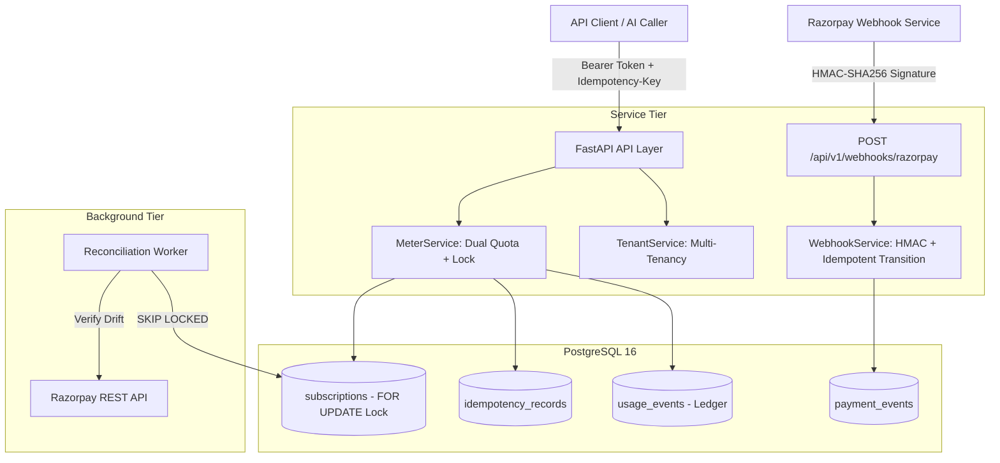

# FlyRank AI Backend Internship Capstone: Usage Metering & Billing Engine

Production-ready, multi-tenant usage metering and subscription billing engine designed for AI platforms. Built for high concurrency, strict quota boundary enforcement, transactional integrity, and cryptographic webhook verification.

---

## Architecture Overview



The system is architected in four strict tiers:
1. **API / Transport Layer (`app/api/`)**: FastAPI routes parsing headers, authentication, and idempotency keys, mapping domain exceptions to RFC-compliant HTTP status codes.
2. **Domain Service Layer (`app/services/`)**: Business logic executing atomic transactional operations (`BEGIN → LOCK/READ → VALIDATE → MUTATE → COMMIT`).
3. **Data Persistence Tier (`app/models/`, `migrations/`)**: PostgreSQL 16 managed via async SQLAlchemy 2.0 with pessimistic row locks (`FOR UPDATE`), partial unique constraints, and covering indices.
4. **Background Reconciliation Worker (`app/workers/`)**: Autonomous async worker reconciling subscription state drift with exponential backoff and `SKIP LOCKED` concurrency.

---

## Approved Adaptation: Stripe → Razorpay Substitution

Per capstone requirements and explicit project authorization, **Razorpay Test Mode / Sandbox** replaces Stripe:
- **Currency**: Canonical Indian Rupee (INR / ₹) with pure-integer micro-INR ($\mu\text{INR}$) internal arithmetic ($1\text{ INR} = 1,000,000\ \mu\text{INR}$).
- **Webhook Security**: Raw payload HMAC-SHA256 verification using `X-Razorpay-Signature` with constant-time comparison (`hmac.compare_digest`), preventing timing attacks.
- **Event Deduplication**: Deduplicated via `x-razorpay-event-id` stored in `payment_events` with unique constraint.
- **State Machine**: Monotonic state transitions preventing out-of-order webhook delivery from resurrecting cancelled subscriptions.
- **Simulation Mode**: Local/mock provider simulation is used for offline evaluation, test suites, and acceptance probes with cryptographic HMAC-SHA256 verification; live Razorpay gateway network execution is neither claimed nor required.

---

## Core Guarantees & Features

### 1. Pure Integer Micro-INR Billing Engine
Floating-point arithmetic is strictly banned to eliminate rounding drift across millions of tokens:
- **Fresh Input Tokens**: ₹40 / 1M tokens = $40\ \mu\text{INR}$ per token
- **Cached Input Tokens**: ₹7.50 / 1M tokens (projected as ₹10 / 1M tokens) = $10\ \mu\text{INR}$ per token (75% cache discount)
- **Output Tokens**: ₹160 / 1M tokens = $160\ \mu\text{INR}$ per token
- **Reasoning Tokens**: ₹160 / 1M tokens = $160\ \mu\text{INR}$ per token
- **Per-Call Cost Calculation**:
  $$\text{Cost}(\mu\text{INR}) = (T_{\text{fresh}} \times 40) + (T_{\text{cached}} \times 10) + (T_{\text{output}} \times 160) + (T_{\text{reasoning}} \times 160)$$

### 2. Dual Quota Enforcement
Every billable call (`POST /api/v1/generate`) consumes **both**:
- Exactly **1 API call**
- Requested **AI tokens** (fresh + cached + output + reasoning)

**Plan Quota Boundaries:**
- **Free Tier**: 1,000 API calls/month, 100,000 AI tokens/month, ₹10.00 per-call budget guard, ₹0/month.
- **Pro Tier**: 50,000 API calls/month, 5,000,000 AI tokens/month, ₹100.00 per-call budget guard, ₹1,999/month.

Both quotas are evaluated atomically inside a pessimistic transaction lock (`SELECT ... FOR UPDATE` on `subscriptions`). If either quota dimension is exceeded, the request is rejected with `429 Too Many Requests` and a standard `Retry-After` header.

### 3. Idempotency with Double-Checked Locking
Protects against network retries and concurrent duplicates:
- Pre-lock check on `idempotency_records` table
- Under `FOR UPDATE` lock, re-check idempotency record
- Payload conflict detection: If the same key is reused with differing request body or tenant, returns `409 Conflict`
- Success: Cached response is returned without duplicate metering or token billing

### 4. Per-Call Budget Guard (PDF Requirement #7)
Prevents runaway prompt costs by rejecting any single call whose projected integer cost exceeds the plan's ceiling ($₹10.00$ on Free tier, $₹100.00$ on Pro tier).

---

## Quickstart & Local Setup

### Prerequisites
- Docker & Docker Compose
- Python 3.12+ (for local development/testing)

### One-Command Startup
```bash
# Clone the repository
git clone <repo-url>
cd "LLM Billing and Usage"

# Start all services (PostgreSQL 16 + FastAPI)
docker compose up --build
```

The application will start on `http://localhost:8000`.
- API Documentation: `http://localhost:8000/docs`
- Healthcheck: `http://localhost:8000/health`

### Database Migrations & Seeding
```bash
# Run migrations inside the container
docker compose exec backend alembic upgrade head

# Seed plans (Free & Pro) and demo tenant
docker compose exec backend python scripts/seed_data.py
```

### Running Tests
```bash
# Run full automated test suite with coverage
docker compose exec backend pytest -v --cov=app tests/
```

---

## API Reference Summary

| Method | Endpoint | Description | Status Codes |
|---|---|---|---|
| `GET` | `/health` | System health & DB connection status | 200, 503 |
| `POST` | `/api/v1/tenants` | Register new tenant and auto-provision Free subscription | 201, 400 |
| `GET` | `/api/v1/tenants/me` | Retrieve authenticated tenant profile and active plan | 200, 401, 403 |
| `POST` | `/api/v1/generate` | Billable LLM dummy endpoint with dual-quota & idempotency | 200, 400, 409, 429 |
| `GET` | `/api/v1/usage` | Current billing period aggregated usage and cost | 200, 401 |
| `GET` | `/api/v1/usage/events` | Paginated raw immutable usage ledger entries | 200, 401 |
| `POST` | `/api/v1/billing/subscription` | Create Razorpay subscription checkout session | 201, 400 |
| `POST` | `/api/v1/webhooks/razorpay` | Cryptographically signed Razorpay webhook receiver | 200, 400 |

---

## Acceptance Probes

1. **Probe 1: Idempotency Enforcement** — Identical key returns cached response; concurrent duplicate calls do not double-bill.
2. **Probe 2: Exact Quota Boundary** — Free tier allows exactly 1,000 calls; call #1001 returns `429 Too Many Requests` with `Retry-After` header.
3. **Probe 3: Successful Payment Transition** — Razorpay `subscription.activated` webhook transitions subscription from Free to Pro immediately.
4. **Probe 4: Webhook Security & Deduplication** — Forged signatures return `400 Bad Request`; replay of processed event returns `{"status": "ignored", "reason": "duplicate_webhook"}`.
5. **Probe 5: Exact Token Pricing** — Validates micro-INR token arithmetic without floating-point error across all 4 token categories.
