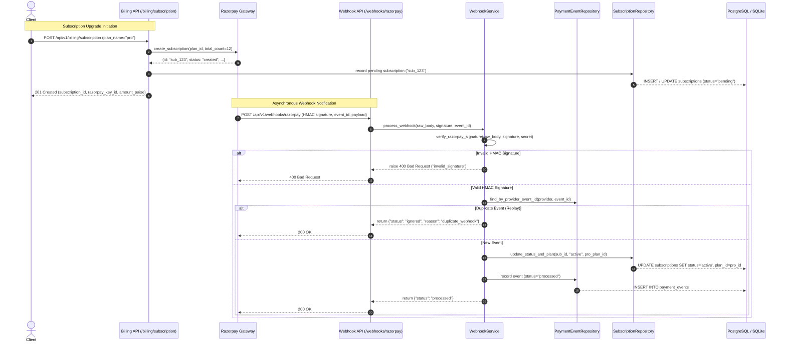

# Razorpay Integration & Webhook Handling Implementation Plan (Phases 9 & 10)

## Overview
Implement the production-grade Razorpay payment integration and webhook processing engine for subscription upgrades, cryptographic HMAC-SHA256 signature verification, and deduplication of replayed webhooks. Fully satisfies FlyRank PDF requirements and executes **Acceptance Probe 3 (Razorpay Test Subscription Upgrade Flow)** and **Acceptance Probe 4 (Webhook Verification & Deduplication)**.

---

## Architecture & Data Flow

---

## Proposed Changes & File Structure

### 1. Payment Integrations Layer
- **`app/integrations/payments/base.py`**:
  Abstract `PaymentProvider` base class with async methods:
  - `create_subscription(plan_id: str, customer_id: str | None, total_count: int = 12) -> dict`
  - `fetch_subscription(subscription_id: str) -> dict`
  - `cancel_subscription(subscription_id: str) -> dict`
- **`app/integrations/payments/razorpay.py`**:
  `RazorpayProvider` implementing `PaymentProvider`. In test/development mode with mock/placeholder credentials, generates valid deterministic mock responses for test subscriptions (`sub_...`). Supports real HTTP calls when genuine keys are configured.

### 2. Repositories
- **`app/repositories/payment_event_repository.py`**:
  - `find_by_provider_event_id(session, provider, provider_event_id)`: Lookup existing event.
  - `create(session, ...)`: Insert processed or ignored payment event.
- **`app/repositories/subscription_repository.py`**:
  Add helper methods:
  - `get_by_provider_subscription_id(provider_subscription_id)`
  - `upgrade_to_plan(subscription_id, plan_id, status, period_start, period_end)`

### 3. Services Layer
- **`app/schemas/billing.py`**:
  Pydantic schemas for `CreateSubscriptionRequest`, `SubscriptionResponse`, and webhook status responses.
- **`app/services/subscription_service.py`**:
  Coordinates subscription creation, links to tenant, and calls provider.
- **`app/services/webhook_service.py`**:
  Handles signature verification, deduplication against `payment_events`, monotonic subscription status transitions, and audit logging.

### 4. API Endpoints
- **`app/api/v1/billing.py`**:
  - `POST /api/v1/billing/subscription`: Initiate Pro upgrade.
  - `GET /api/v1/billing/subscription`: View active tenant subscription.
- **`app/api/v1/webhooks.py`**:
  - `POST /api/v1/webhooks/razorpay`: High-security endpoint receiving raw payload, `X-Razorpay-Signature`, and `x-razorpay-event-id`.
- **`app/main.py`**:
  Register `billing` and `webhooks` routers under `/api/v1`.

### 5. Automated Tests & Acceptance Probes
- `tests/unit/test_payment_provider.py`: Provider initialization, mock handling, contract validation.
- `tests/unit/test_payment_event_repo.py`: Deduplication queries, uniqueness constraints.
- `tests/unit/test_webhook_service.py`: Forged signature rejection, duplicate replay detection, lifecycle status transitions.
- `tests/integration/test_billing_api.py`: `POST` and `GET /api/v1/billing/subscription` flows.
- `tests/integration/test_acceptance_probes_webhooks.py`:
  - **Probe 3 (Razorpay Test Subscription Upgrade Flow)**: Webhook activates subscription; `GET /api/v1/usage` reflects Pro limits (50k calls, 5M tokens).
  - **Probe 4 (Webhook Verification & Deduplication)**: Forged returns 400; valid returns 200 processed; replay returns 200 ignored.

---

## Step-by-Step Implementation Tasks

### Task 1: Payment Provider Interface & Razorpay Adapter
- Create `app/integrations/payments/base.py` and `app/integrations/payments/razorpay.py`.
- Write unit test `tests/unit/test_payment_provider.py`.
- Run tests and commit.

### Task 2: Payment Event Repository & Subscription Repository Extensions
- Create `app/repositories/payment_event_repository.py`.
- Update `app/repositories/subscription_repository.py` with `get_by_provider_subscription_id` and monotonic state transition checks.
- Write unit test `tests/unit/test_payment_event_repo.py`.
- Run tests and commit.

### Task 3: Billing Schemas & Services (`SubscriptionService` & `WebhookService`)
- Create `app/schemas/billing.py`.
- Create `app/services/subscription_service.py` and `app/services/webhook_service.py`.
- Write unit test `tests/unit/test_webhook_service.py`.
- Run tests and commit.

### Task 4: Billing API Router (`POST` & `GET /api/v1/billing/subscription`)
- Create `app/api/v1/billing.py`.
- Register router in `app/main.py`.
- Write integration tests in `tests/integration/test_billing_api.py`.
- Run tests and commit.

### Task 5: Webhook API Router (`POST /api/v1/webhooks/razorpay`)
- Create `app/api/v1/webhooks.py`.
- Register router in `app/main.py`.
- Handle raw body extraction, `X-Razorpay-Signature`, `x-razorpay-event-id` (case-insensitive header fallback).
- Run tests and commit.

### Task 6: Acceptance Probes 3 & 4 Verification
- Create `tests/integration/test_acceptance_probes_webhooks.py`.
- Implement `test_probe_3_pro_upgrade`:
  - Seed tenant on Free tier with pending subscription `sub_probe3_test`.
  - Send valid `subscription.activated` webhook with proper HMAC signature.
  - Assert 200 OK `{"status": "processed"}`.
  - Assert DB subscription is `active` and plan is `pro`.
  - Assert `GET /api/v1/usage` returns `plan="pro"`, `api_calls.limit=50000`, `ai_tokens.limit=5000000`.
- Implement `test_probe_4_webhook_security`:
  - 4a (Forged): Tampered HMAC -> 400 Bad Request `{"error": "invalid_signature"}`, 0 DB mutations.
  - 4b (Valid): Genuine HMAC -> 200 OK `{"status": "processed"}`, 1 row in `payment_events`.
  - 4c (Replay): Same event ID resent -> 200 OK `{"status": "ignored", "reason": "duplicate_webhook"}`, 0 duplicate mutations.
- Run tests and verify both probes pass. Commit.

### Task 7: Documentation & Evidence Verification
- Run complete test suite (`pytest -v --cov=app tests/`).
- Update `BUILDLOG.md` and `EVIDENCE.md` with actual probe execution evidence.
- Push to remote `main`.
